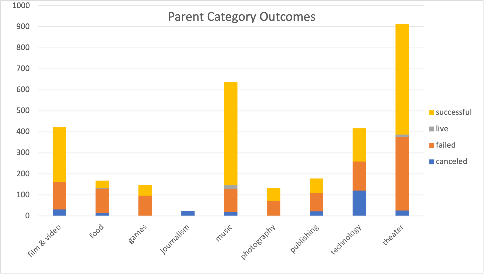
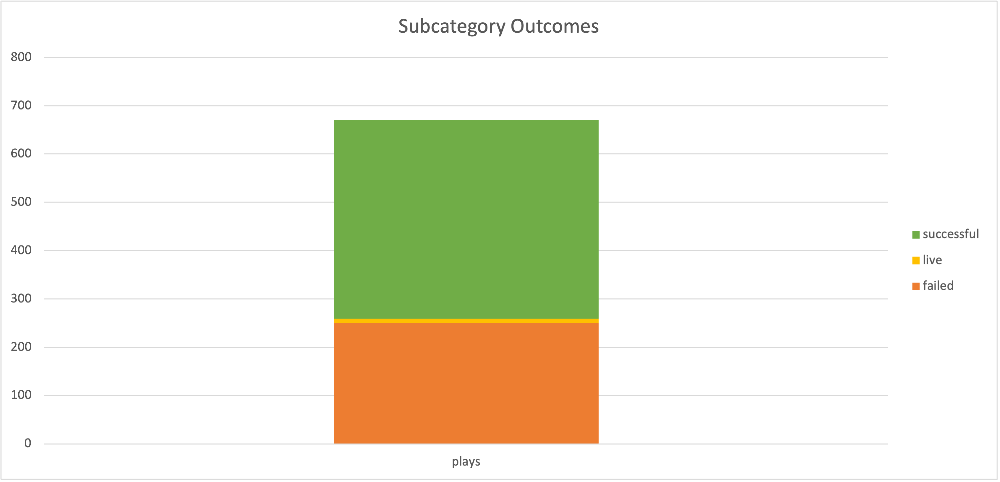
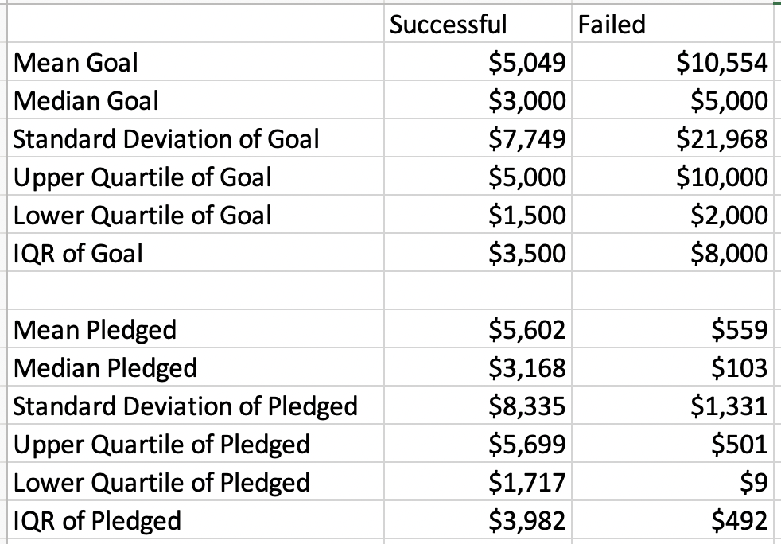
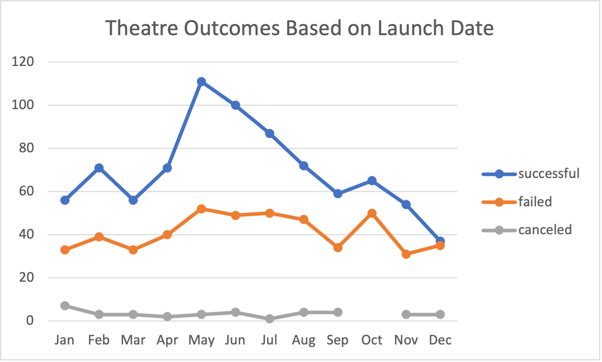
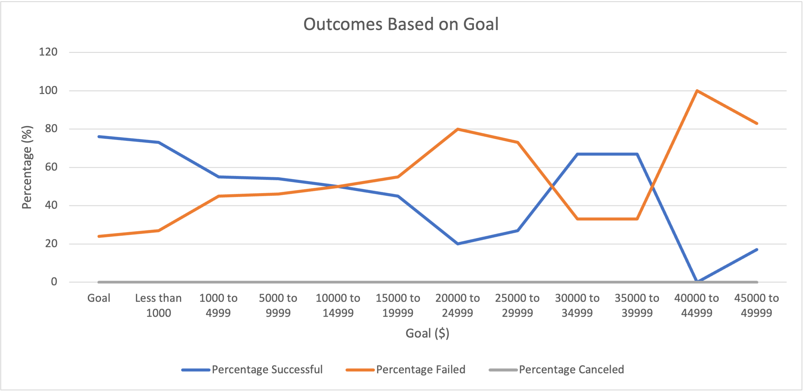

# Kickstarting with Excel

## Overview of Project

### Purpose and Background
**Background** 

Louise, a playwrite, wants to create a successful crowdfunding campaign to fund her play 'Fever'. Initially, she is asking for $10,000. She wants us to analyze previous crowdfunding campaign data in Excel to ensure that her fundraising campaign will be successful. 

With looking at the initial data of the crowdfunding data in the US, we found that out of the parent categories, theatre had the most successful outcomes (17%). Within the subcategory "plays," there are more successful vs failed outcomes (67%). See the visualizations made from pivot charts below. 

From here, we looked at Successful vs. Failed US Kickstarters and analyzed the statistics of their goals and pledges. We can assume that failed kickstarter campaigns had much higher fundraising goals than those who were successful in the US. 

**Purpose** 

After fundraising for her play *Fever*, Louise wants to know how different campaigns were successful using the information we have on crowdfunding different Kickstarters. Specifically, Louise wants us to look at the relationship between launch dates and funding goals. The purpose is to analyze different fundraising scenarios - specifically finding outcomes based on launch date start for theatres and outcomes based on monetary goals for plays. 

## Analysis and Challenges

### Analysis of Outcomes Based on Launch Date
To find the relationship between successful and failed outcomes based on launch date, we first had to extract the year from the Date Created Conversion column of each campaign. We did this by using the ***YEAR()*** function. Next, we created a pivot chart to portray the count of theatre outcomes that were either successful, failed, or canceled with the month launched as the rows. Lastly, we created a line chart from the pivot table. See the line chart below.

Out of the 1,369 Kickstarter campaigns for theatres, May is the best time to launch a campaign. We can also assume that May (111 successes), June (100) and July (87) would also be great months to launch. On the other hand, we can also assume that in November (54) and December (37), launch dates were not as successful.

### Analysis of Outcomes Based on Goals
To find the relationship between outcomes based on goals, we created a chart to count how many successful, failed, and canceled campaigns there were based on their goals. We also wanted to find the outcomes of plays. To do this, we created a table using the ***COUNTIF()*** function. For the independent variables, we used increments of goals (Less than 1000, 1000 to 4999, etc.) to see if there was a relationship with the percent successful/ failed/ canceled. For example, we used the formula =COUNTIFS(Kickstarter!F:F,"successful", Kickstarter!D:D, "<1000", Kickstarter!R:R, "plays") to find the Number of Successful campaigns for plays with goals Less than 1000. After making the table, we found the percentage of successful, failed and canceled to make a line chart "Outcomes Based on Goal". 

We know that if the fundraising goal is met by the pledges and backers of a campaign, a campaign will more likely be successful. From the Kickstarter data, we were able to filter and determine the percentage of campaigns that were successful, failed or canceled based on their goal. See the chart below.  

### Challenges and Difficulties Encountered
A challenge that occured while creating this analysis for Louise was creating the Outcomes Based on Goals table. With the COUNTIF() function, order matters of the filtering of the criteria. I I originally put the end goal after the criteria of counting "plays" from the Kickstarter Goal column. For example, the function I first used was: =COUNTIFS(Kickstarter!F:F, "failed", Kickstarter!D:D, ">=1000", Kickstarter!R:R, "plays", Kickstarter!D:D, "<=4999"). After copying the formulas throughout the rest of the table, creating a graph, and seeing if the solution matched - it did not. Then I realized that order matters for the formula. Instead, the corrected formula for cell C3 on the Outcomes Based on Goals sheet is: =COUNTIFS(Kickstarter!F:F, "failed", Kickstarter!D:D, ">=1000", Kickstarter!D:D, "<=4999", Kickstarter!R:R, "plays").

Another difficulty encountered was writing the summaries and data analysis from the information procured on Microsoft Excel. As a math major, doing the actual formulas and solutions are easier than word problems! After re-reading through the modules and trying to make more sense of the data, I was able to have a clearer understanding of the background of the numbers and the story we wanted our numbers to tell. 

## Results

- What are two conclusions you can draw about the Outcomes based on Launch Date?

1. There were a total of 1,369 Kickstarter campaigns for theatres. The month that launched the most successful theatre campaigns were in the month of May (111) and June (100). We also see that more campaigns were launched in these months (total launched = 166 and 153) vs. December (75). 
2. We also see that from November to December, successful theatre kickstarters decline while failed outcomes increase. This means that Louise should not launch her fundraising campaign during November - December. Specifically, we see that launching kickstarters in December has almost the same amount of successes (37) and failure campaigns (35).

- What can you conclude about the Outcomes based on Goals?

1. From the data in the line graph Outcomes Based on Goal, we can see that the fundraisers with lower goals (< $1000 to $14,999) had higher percentage rates of being successful (>= 50% success rate). From the Percentage Failed, we see that those who had higher goals had a higher perecentage rate of failing - specifically goals that were above $14,999. 
2. We see the most success with kickstarters who have below a $4999 goal (an average of 74.5% success). From this, my final recommendation would be for Louise to lower her initial goal amount from $10,000 to $5000 to increase her chances of success in fundraising her project. 

- What are some limitations of this dataset?

1. Some limitations of this dataset is that there is no new data since the year 2017. If we had more up-to-date information, we would have a more accurate depiction for suggestions for Louise's campaign.
2. The data from Theatre Outcomes by Launch Date and Outcomes Based on Goals were not first filtered to the US only. This is data from all countries. If we wanted to make a more specific data analysis for Louise, we should have filtered to show only US Goals or Outcomes first. 
3. If there were more data for Kickstarter plays, we would have a better understanding of Outcomes Based on Goals. Most of this data comes from the goal range of $1000 to 4999. Right now, we only have a total of 1,043 projects to understand the percentage successful vs failed outcomes based on their monetary goals. 

- What are some other possible tables and/or graphs that we could create?

Some other tables/ graphs that would be helpful for Louise would be: 
1. Adding a filter for country to the pivot table for sheet 'Theatre Outcomes by Launch Date'. This would allow for more accurate data relating to the US. 
2. Adding percentage of success and failure for Theatre Outcomes Based on Launch Dates table 
3. Descriptive Statistics table and box plot for Successful Vs. Failed US Kickstarters for theater plays 
4. Table and graph showing if there is a correlation for the length of a kickstarter and rate of success
